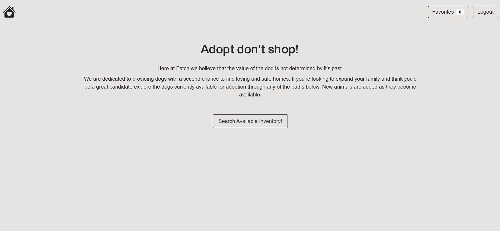
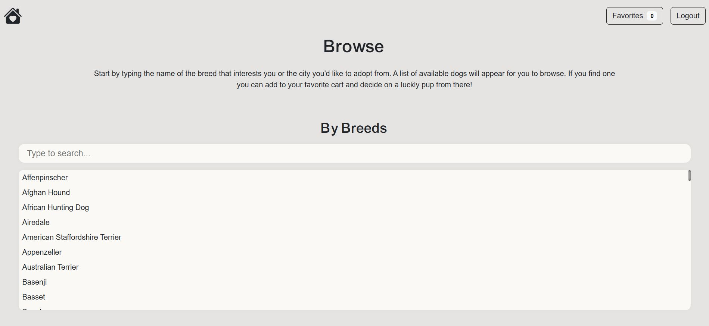
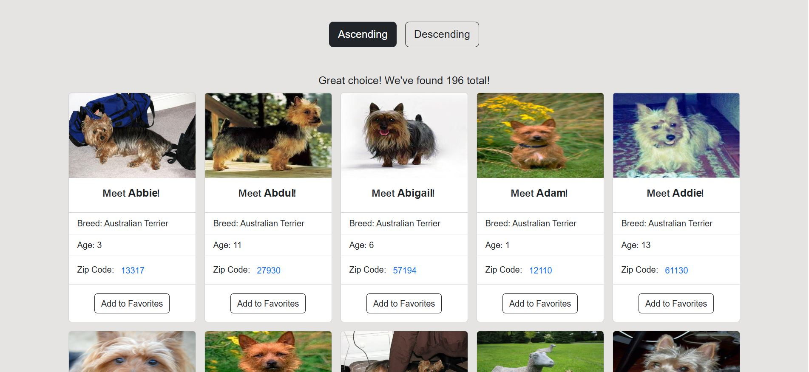
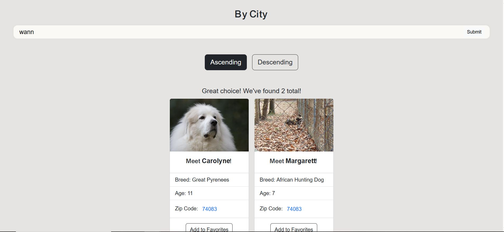
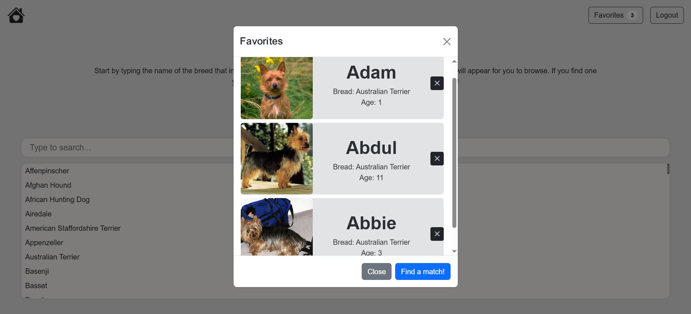
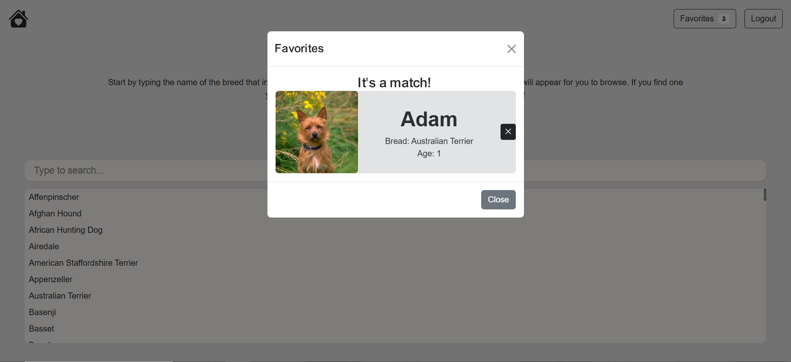

# Fetch - Adopt don't shop!

This is an authentication-based web application where users can browse available dogs to adopt. This app uses a fetch API to retrieve, authenticate, display, and modify data from an external API.

## Table of contents

- [Overview](../README-template.md#overview)
  - [The challenge](../README-template.md#the-challenge)
  - [Screenshot](../README-template.md#screenshot)
  - [Links](../README-template.md#links)
- [My process](../README-template.md#my-process)
  - [Built with](../README-template.md#built-with)
  - [What I learned](../README-template.md#what-i-learned)
  - [Continued development](../README-template.md#continued-development)
- [Author](../README-template.md#author)

## Overview

### The challenge

Users should be able to:

- View the optimal layout for the site depending on their device's screen size
- Enter through authenticating name and email
- Browse 10,000 available dogs by entering breed or city name
- Modify the data from displaying in ascending or descending order
- Add dogs to the favorites list
- View the favorites list and remove items from it
- Find a match!

### Screenshots

### Home Page

With over 10,000 dogs looking for a new home, adopt don't shop!

### Browse Page

Browse thousands of available dogs using breed name or city.

### Dog Info

View dogs and add to favorites list. Nice pic!

### Favorites list

View and edit favorites list.

### You've got a match!

View match and prepare to meet your new best friend.

### Links

- [GitHub](https://github.com/abigailjulie/Fetch)
- [Vercel](https://fetch-silk.vercel.app/)

## My process

### Built with

- [Bootstrap](https://react-bootstrap.netlify.app/)
- [React](https://reactjs.org/)
- JavaScript
- [React Bootstrap](https://react-bootstrap.netlify.app/)
- Object-oriented programming
- API Integration
- Mobile-first workflow
- Semantic HTML5 markup
- CSS custom properties
- Flexbox
- ADA

### What I learned

API integration is a cornerstone of software engineering. I was able to fetch data from various endpoints using cursor pagination, query, and body parameters. I used several JavaScript libraries and Bootstrap to create an intuitive UX/UI. I learned a lot about passing information within a complex architecture through props and look forward to incorporating custom hooks and utils in future versions.

### Continued development

Making web applications that are readable and scalable is something that I plan to make second-nature when I code. In future versions of this app, I will incorporate custom hooks and utils. I've identified four files with more than 80 lines of code. Splitting those up and creating helper files based on similar functions would help achieve cleaner code. I would also incorporate a file for error handling that would display an error message to the user. While console logs helped me to pinpoint issues, they're not the ideal method for production. Next time, I would set up error handling measures at the start of a project and incorporate them as needed.

## Author

- [Abigail Figaro](https://www.abigaildesigns.org)
- [LinkedIn](https://www.linkedin.com/in/abigailfigaro/)
